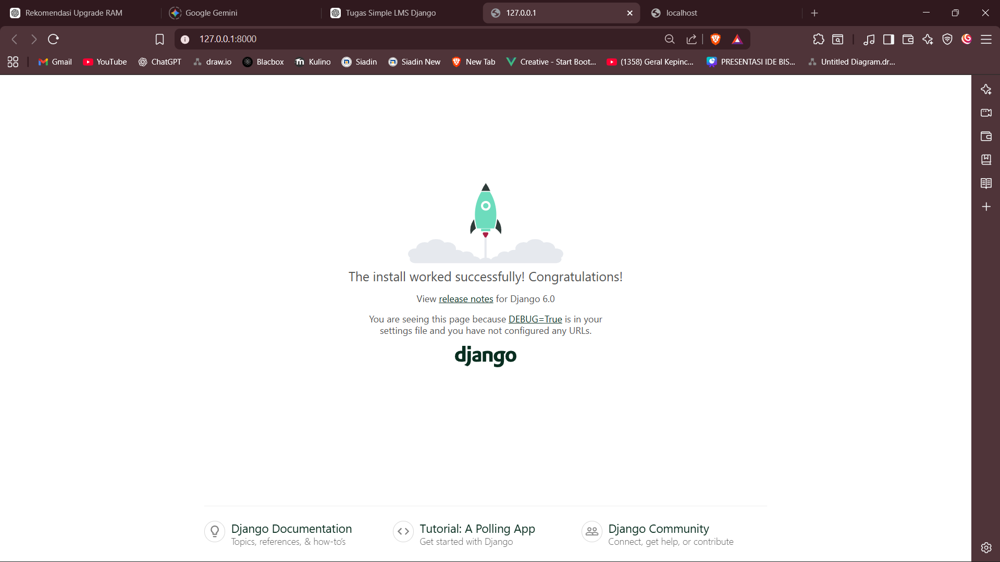

# Simple LMS - Django + Docker
## Cara Menjalankan Project

## 1. Clone Repository

```bash
git clone <URL_REPOSITORY_KAMU>
cd simple-lms
```

## 2. Jalankan Docker Compose

```bash
docker compose up --build
```

## 3. Jalankan Migrasi Database

Buka terminal baru:

```bash
docker exec -it django_app bash
python manage.py migrate
```

## 4. Akses Aplikasi

Buka browser:

```text
http://127.0.0.1:8000
```

---

## Environment Variables

File `.env` digunakan untuk konfigurasi database:

```env
DB_NAME=lms_db
DB_USER=lms_user
DB_PASSWORD=lms_pass
DB_HOST=db
DB_PORT=5432
```

---

## Docker Services

## 1. Web (Django)

* Menjalankan aplikasi Django
* Port: 8000

## 2. Database (PostgreSQL)

* Database utama aplikasi
* Port: 5432

---

## Konfigurasi Django

### Database Connection

Django terhubung ke PostgreSQL menggunakan konfigurasi di `settings.py` melalui environment variables.

## Static Files

Static files dikelola oleh Django dan dapat dikembangkan lebih lanjut menggunakan `collectstatic`.

---

## Struktur Project

```
simple-lms/
├── docker-compose.yml
├── Dockerfile
├── .env
├── requirements.txt
├── manage.py
├── config/
│   ├── settings.py
│   ├── urls.py
│   └── wsgi.py
└── README.md
```

---

## Screenshot

## Django Welcome Page




## Jawaban Pertanyaan

## 1. Kenapa perlu volume untuk PostgreSQL?
Volume digunakan agar data database tetap tersimpan walaupun container dihentikan atau dihapus.

## 2. Apa fungsi depends_on?

`depends_on` digunakan untuk memastikan service database berjalan terlebih dahulu sebelum service web dijalankan.

## 3. Bagaimana Django connect ke PostgreSQL?

Django menggunakan konfigurasi di `settings.py` dengan bantuan environment variables seperti `DB_HOST`, `DB_NAME`, `DB_USER`, dan `DB_PASSWORD`.

---
